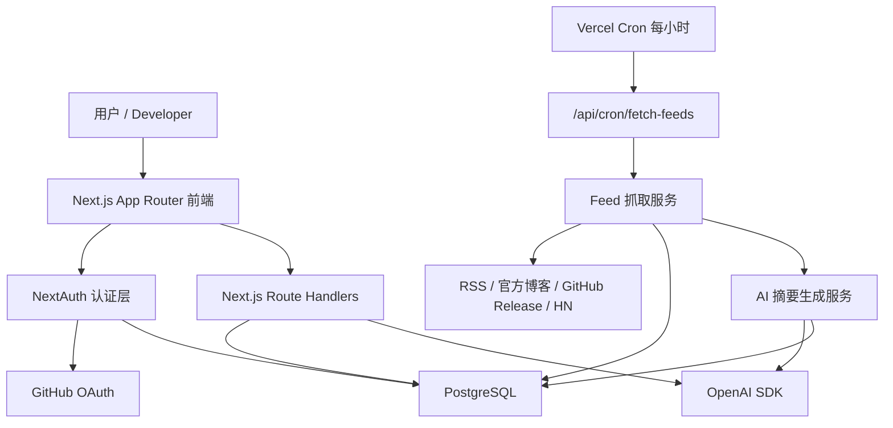
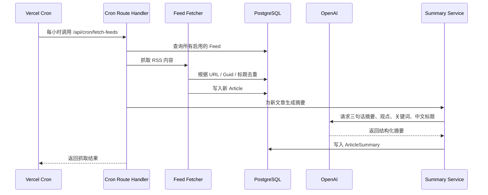
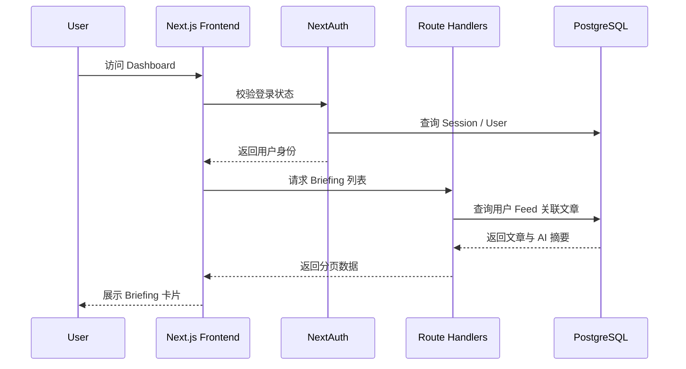
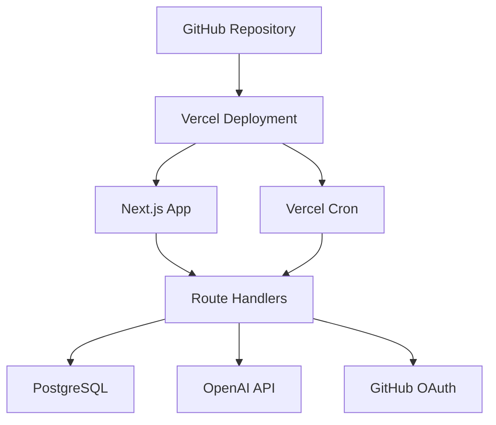

# 系统架构设计

## 1. 总体架构

## 2. 核心模块

```mermaid
flowchart LR
  subgraph Frontend["Frontend: Next.js + TailwindCSS + shadcn/ui"]
    Login["Login"]
    Dashboard["Dashboard"]
    FeedMgmt["Feed Management"]
    ArticleDetail["Article Detail"]
    Bookmarks["Bookmarks"]
    Settings["Settings"]
  end

  subgraph Backend["Backend: Route Handlers"]
    AuthAPI["Auth APIs"]
    FeedAPI["Feed APIs"]
    ArticleAPI["Article APIs"]
    BookmarkAPI["Bookmark APIs"]
    SearchAPI["Search APIs"]
    CronAPI["Cron APIs"]
  end

  subgraph Domain["Domain Services"]
    FeedService["Feed Service"]
    ArticleService["Article Service"]
    SummaryService["AI Summary Service"]
    SearchService["Search Service"]
  end

  subgraph Infra["Infrastructure"]
    DB["PostgreSQL + Prisma"]
    AI["OpenAI SDK"]
    Cron["Vercel Cron"]
  end

  Frontend --> Backend
  Backend --> Domain
  Domain --> Infra
```

## 3. 内容抓取流程

## 4. 用户访问流程

## 5. 部署架构

## 6. 架构边界

- MVP 采用单体 Next.js 架构
- 前端页面、API、认证、Cron 入口在同一个 Next.js 项目中
- 业务逻辑放在 `src/services/`
- 数据访问统一通过 Prisma
- AI 调用封装为独立服务，便于后续替换模型或加入队列
- Cron 接口需要鉴权
- 抓取和 AI 摘要失败不影响用户访问已有 Briefing

## 7. V2 预留点

- AI 问答：增加检索服务和问答 API
- 邮件日报：增加邮件发送服务和每日 Cron
- 趋势分析：增加统计任务和趋势表
- 向量搜索：增加 embedding 字段或独立 `ArticleEmbedding` 表
