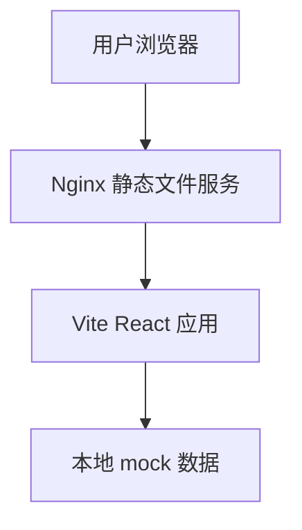
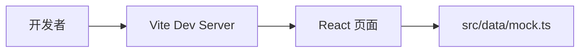
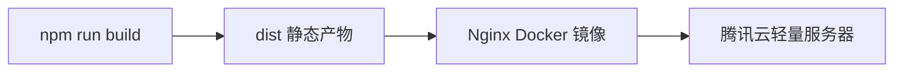

# 当前架构说明

当前版本目标是先部署一个可以访问和演示的前端界面，因此架构收敛为静态前端。

## 总体架构

## 本地开发

## 生产部署

## 当前边界

- 不接入数据库
- 不接入登录
- 不提供 REST API
- 不执行 RSS 抓取
- 不调用 OpenAI
- 页面文字全部使用中文
- 数据来自 `src/data/mock.ts`

## 后续演进

后续可以按以下顺序逐步接入真实功能：

1. 接入真实 RSS 数据源
2. 增加后端 API
3. 接入数据库
4. 接入 AI 摘要
5. 增加用户系统和收藏持久化
