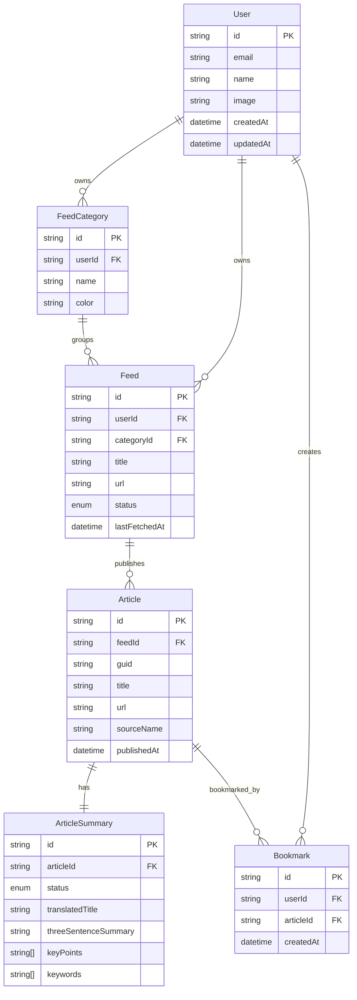

# 数据库设计

## 1. 数据模型

当前 Prisma Schema 位于：

```txt
prisma/schema.prisma
```

核心模型：

- `User`
- `FeedCategory`
- `Feed`
- `Article`
- `ArticleSummary`
- `Bookmark`

## 2. 关系图



## 3. 关键约束

- `FeedCategory.userId + FeedCategory.name` 唯一
- `Feed.userId + Feed.url` 唯一
- `Article.feedId + Article.url` 唯一
- `Article.feedId + Article.guid` 唯一
- `ArticleSummary.articleId` 唯一
- `Bookmark.userId + Bookmark.articleId` 唯一

## 4. 查询索引

- Briefing 时间流：`Article.publishedAt`
- 用户 Feed 列表：`Feed.userId + Feed.status`
- 分类 Feed：`Feed.categoryId`
- 抓取去重：`Article.feedId + Article.url`、`Article.feedId + Article.guid`
- 用户收藏列表：`Bookmark.userId + Bookmark.createdAt`
- 摘要任务扫描：`ArticleSummary.status`
- Feed 抓取调度：`Feed.lastFetchedAt`

## 5. 设计说明

- 当前实现只保留一个系统用户，不包含认证相关表
- `Feed` 绑定系统用户，便于后续平滑扩展回多用户模式
- `Article` 绑定 Feed，文章去重优先依赖 URL 和 Guid
- `ArticleSummary` 与 `Article` 一对一，摘要失败不影响文章存在
- `Bookmark` 仍然保留用户维度，但当前用户固定为系统用户
- V2 向量搜索可增加 `ArticleEmbedding` 表或 embedding 字段
